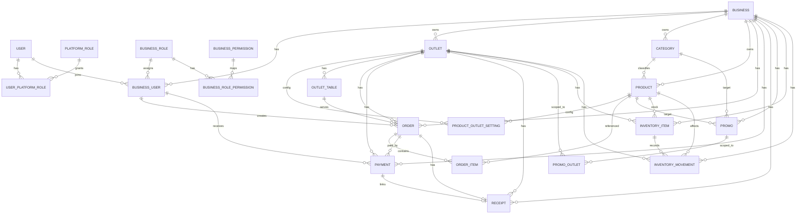

# ERD / Database Schema

Sumber utama: `pos_api/prisma/schema.prisma` (PostgreSQL + Prisma).

## Entity Relationship Diagram (Core)

## Model Inti

- Identity & akses: `User`, `PlatformRole`, `UserPlatformRole`, `BusinessUser`, `BusinessRole`, `BusinessPermission`.
- Organisasi: `Business`, `Outlet`, `BusinessFeatureFlag`.
- Master data: `Category`, `Product`, `ProductOutletSetting`, `OutletTable`.
- Transaksi: `Order`, `OrderItem`, `Payment`, `Receipt`.
- Promo: `Promo`, `PromoOutlet`.
- Inventory: `InventoryItem`, `InventoryMovement`.
- POS config: `OutletPosChargeRule`, `OutletRoundingSetting`.

## Enum Penting

- Status: `UserStatus`, `BusinessStatus`, `OutletStatus`, `OrderStatus`, `PaymentStatus`, dll.
- Akses: `PlatformRoleCode`, `BusinessRoleCode`, `BusinessPermissionCode`.
- Promo: `PromoTargetType`, `PromoDiscountType`, `PromoOutletScope`.
- Inventory: `InventoryMovementType`.
