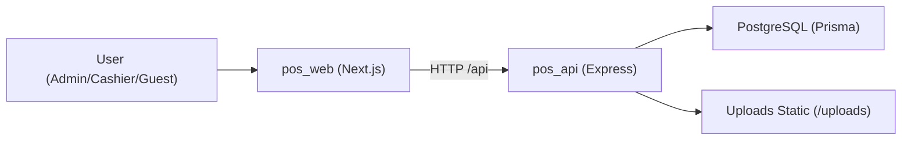

# Tech Doc

## Ringkasan

POS Platform adalah monorepo dengan dua aplikasi utama:

- `pos_api`: backend REST API berbasis Express + Prisma.
- `pos_web`: frontend Next.js (App Router) untuk dashboard dan guest flow.

## Tech Stack

### Backend (`pos_api`)

- Runtime: Node.js
- Language: TypeScript (strict mode)
- Framework: Express
- ORM: Prisma
- DB: PostgreSQL
- Validation: Zod
- Auth: JWT + role/permission middleware
- Testing: Jest + Supertest

### Frontend (`pos_web`)

- Framework: Next.js 16 (React 19)
- Language: TypeScript (strict mode)
- Styling: CSS + Tailwind tooling
- Form/validation: React Hook Form + Zod
- HTTP client: Axios + Fetch (guest module)
- Testing: Vitest + Playwright

## Arsitektur Tingkat Tinggi



## Struktur Direktori Utama

```text
pos_platform/
  pos_api/
    src/
      modules/
      middlewares/
      routes/
      utils/
    prisma/
    tests/
  pos_web/
    src/
      app/
      components/
      lib/
      types/
    tests/
```

## Pola Backend

- Module-first (`src/modules/*`) berisi controller/service/routes/validation.
- `src/routes/index.ts` menjadi central route registration.
- Middleware berlapis:
  - `authMiddleware` untuk JWT.
  - `businessAccessMiddleware` untuk konteks bisnis + `x-business-id`.
  - permission middleware untuk otorisasi fitur.
- Response shape konsisten: `successResponse` dan `errorResponse`.

## Pola Frontend

- App Router (`src/app/**/page.tsx`) untuk route UI.
- API access lewat `src/lib/*`.
- Token auth disimpan di storage client, otomatis attach `Authorization` header pada axios interceptor.
- Beberapa endpoint business-scoped menambahkan `x-business-id` dari localStorage.

## Integrasi Data

- Seluruh akses DB backend lewat Prisma client (`src/config/prisma.ts`).
- Schema utama berada di `pos_api/prisma/schema.prisma`.
- Seed data (`prisma/seed.ts`) menyediakan akun demo, role-permission, feature flags, dan data master awal.
